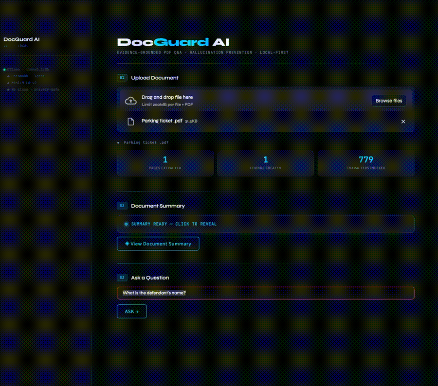

<div align="center">

```
██████╗  ██████╗  ██████╗ ██████╗ ██╗   ██╗ █████╗ ██████╗ ██████╗      █████╗ ██╗
██╔══██╗██╔═══██╗██╔════╝██╔════╝██║   ██║██╔══██╗██╔══██╗██╔══██╗    ██╔══██╗██║
██║  ██║██║   ██║██║     ██║  ███╗██║   ██║███████║██████╔╝██║  ██║    ███████║██║
██║  ██║██║   ██║██║     ██║   ██║██║   ██║██╔══██║██╔══██╗██║  ██║    ██╔══██║██║
██████╔╝╚██████╔╝╚██████╗╚██████╔╝╚██████╔╝██║  ██║██║  ██║██████╔╝    ██║  ██║██║
╚═════╝  ╚═════╝  ╚═════╝ ╚═════╝  ╚═════╝ ╚═╝  ╚═╝╚═╝  ╚═╝╚═════╝     ╚═╝  ╚═╝╚═╝

         EVIDENCE-GROUNDED PDF Q&A · HALLUCINATION DEFENSE · LOCAL-FIRST
```

[](https://www.python.org/)
[](https://streamlit.io)
[](https://ollama.com)
[](https://www.trychroma.com)
[](LICENSE)
[](https://www.apple.com/mac/)
[]()

> A local-first RAG system that **refuses to hallucinate**. Every answer is grounded in retrieved evidence with page-level citations. When evidence is insufficient or an answer fails type-validation, the system refuses rather than fabricates.

</div>

---

## 🎬 Demo

<div align="center">
  
  <br/>
  <em>DocGuard AI extracting a monetary field from a parking ticket PDF, with page-level citation and source evidence panel.</em>
</div>

<br/>


---

## About

**DocGuard AI** is an evidence-grounded question answering system for PDF documents, built around a single principle: **the system should refuse to answer when it doesn't have enough evidence, instead of fabricating a plausible-sounding response.**

Most off-the-shelf RAG pipelines will happily generate confident-looking answers even when the retrieved context is irrelevant, contradictory, or missing entirely. This is the fundamental hallucination problem — and it's why people don't trust LLMs with real documents like contracts, medical records, financial statements, or legal filings.

DocGuard AI addresses this with a **three-layer hallucination defense**:

1. **Retrieval Guard** — Before the LLM ever sees the query, the system inspects the retrieved chunks. If semantic similarity is too weak or the total evidence is too thin, the system refuses immediately with a clear reason.
2. **Type-aware System Prompt** — The LLM is constrained by explicit rules about what valid answers look like for each question type (names, dates, monetary amounts, IDs). It's instructed to refuse — using a fixed refusal phrase — when the evidence doesn't actually contain the answer.
3. **Conditional Validator** — When the question asks for an identity-like value (names, defendants, parties) and the LLM returns something that looks suspiciously like a code or ID, a second LLM call validates whether the answer is type-consistent with what was asked.

Every answer includes **page-level citations** linking back to the exact chunk used as evidence, so you can verify the source in one click.

### What makes it different

- **Local-first.** Runs entirely on your machine via [Ollama](https://ollama.com) (llama3.1:8b) and a local [ChromaDB](https://www.trychroma.com) instance. No documents leave your computer. No API keys. No cloud calls.
- **Honest refusals over confident hallucinations.** The system tells you *why* it refused — weak retrieval, missing evidence, or failed validation — in four distinct UI states.
- **Calibrated, not hand-wavy.** Distance thresholds are empirically tuned to the embedding model (`all-MiniLM-L6-v2`), not picked from a blog post.
- **Production-grade hygiene.** HTML-escaped user content, ChromaDB client singleton, absolute path resolution, automatic upload cleanup, safe-k clamping — the kind of details that make the difference between a demo and a tool.

### Built for

- People who care more about being **right** than about looking smart.
- Anyone who's been burned by an LLM confidently making up a number from a document.
- Engineers evaluating whether RAG can be trusted in production workflows.

### Use cases

- **Legal & compliance** — Querying contracts, filings, regulatory documents where wrong answers carry real consequences.
- **Financial documents** — Extracting specific figures, dates, and identifiers from receipts, statements, and reports.
- **Research** — Searching across academic PDFs with verifiable citations.
- **Personal document Q&A** — Anything from a parking ticket to a 200-page user manual, without sending it to OpenAI.

---

## Table of Contents

- [Demo](#-demo)
- [About](#about)
  - [What makes it different](#what-makes-it-different)
  - [Built for](#built-for)
  - [Use cases](#use-cases)
- [The Problem](#the-problem)
- [Architecture](#architecture)
- [Features](#features)
- [Tech Stack](#tech-stack)
- [Results](#results)
- [Performance](#performance)
- [Quickstart](#quickstart)
  - [Prerequisites](#1-prerequisites)
  - [Install Ollama](#2-install-ollama-and-pull-the-model)
  - [Python Environment](#3-set-up-the-python-environment)
  - [Environment Variables](#4-configure-environment-variables)
  - [Run the App](#5-run-the-application)
- [Usage](#usage)
  - [Response States](#response-states)
- [Configuration Reference](#configuration-reference)
- [Project Structure](#project-structure)
- [Design Decisions](#design-decisions)
- [Evaluation Pipeline](#evaluation-pipeline)
- [Troubleshooting](#troubleshooting)
- [Limitations](#limitations)
- [Roadmap](#roadmap)
- [Contributing](#contributing)
- [Security](#security)
- [License](#license)
- [Acknowledgements](#acknowledgements)
- [Author](#author)

---

## The Problem

Generic RAG systems share a common failure mode: when retrieval returns ambiguous or partial evidence, the underlying LLM confidently produces an answer anyway. For document QA in privacy-sensitive contexts — legal, financial, medical — **a wrong answer is worse than no answer**.

DocGuard AI distinguishes between three distinct failure modes and surfaces each one transparently to the user, with a human-readable reason for every refusal. This makes the system's epistemic state legible: you always know whether a missing answer means *"the document doesn't cover this"*, *"the evidence exists but isn't precise enough"*, or *"the extracted value doesn't pass type-validation"*.

---

## Architecture

```
                   ┌────────────────────────────────────┐
                   │              UPLOAD                │
                   │  PDF → pypdf → page-aware chunks   │
                   │  → MiniLM-L6-v2 → ChromaDB         │
                   └────────────────────────────────────┘
                                    │
                                    ▼
                   ┌────────────────────────────────────┐
                   │              QUERY                 │
                   │  Question → embed → top-k retrieve │
                   └────────────────────────────────────┘
                                    │
                                    ▼
              ┌─────────────────────────────────────────────┐
              │       LAYER 1: RETRIEVAL GUARD              │
              │  Distance + min-evidence-length checks      │
              │  core/guard.py                              │
              └─────────────────────────────────────────────┘
                    │ pass                       │ fail
                    ▼                            ▼
              ┌─────────────────────┐   ┌────────────────────┐
              │ LAYER 2: LLM        │   │  ⚠ GUARD REFUSED   │
              │ System prompt with  │   │  + reason string   │
              │ type rules + table  │   └────────────────────┘
              │ parsing guidance    │
              │ core/llm_ollama.py  │
              └─────────────────────┘
                    │ answer           │ refusal
                    ▼                  ▼
              ┌─────────────────────────────────────────────┐
              │  LAYER 3: TARGETED VALIDATOR (conditional)  │
              │  Triggers on: identity question + code-like │
              │  answer heuristic (~5–10% of queries)       │
              │  core/llm_ollama.py → _needs_validation()   │
              └─────────────────────────────────────────────┘
                    │ VALID                    │ INVALID
                    ▼                          ▼
              ┌─────────────────┐   ┌──────────────────────┐
              │  ● ANSWERED     │   │  ⊘ VALIDATION FAILED │
              │  + citations    │   │  + reason string     │
              └─────────────────┘   └──────────────────────┘
```

### Layer Summary

| Layer | Component | Catches |
|-------|-----------|---------|
| 1 — Retrieval Guard | `core/guard.py` | Semantic mismatch; document does not cover the topic |
| 2 — System Prompt | `core/llm_ollama.py` | In-context insufficiency; evidence exists but answer doesn't |
| 3 — Validator | `core/llm_ollama.py` | Type violations; LLM extracted something implausible for the field |

---

## Features

| Feature | Details |
|---------|---------|
| **Evidence-grounded answers** | Responses generated exclusively from retrieved document chunks |
| **Page-level citations** | Every factual claim references the exact page it came from |
| **Four-state response surface** | `ANSWERED` / `GUARD REFUSED` / `NO ANSWER FOUND` / `VALIDATION FAILED` |
| **Human-readable refusal reasons** | e.g. `Top evidence match is too weak (distance 1.94 > 1.8)` |
| **Document summary** | Auto-generated on upload, cached; bypasses guard for reliability |
| **Fully local** | No cloud APIs, no telemetry, no data leaves the machine |
| **Privacy-safe** | PDFs and vector store live entirely on disk |
| **HTML-safe rendering** | All dynamic content HTML-escaped before display |
| **Singleton ChromaDB client** | One persistent client per process; no per-query reconnect overhead |
| **Safe top-k clamping** | `n_results` clamped to collection size; no crash on small PDFs |
| **Auto upload cleanup** | Previous PDF deleted on new upload; no storage accumulation |
| **Absolute path resolution** | Storage paths anchored to project root; CWD-independent |

---

## Tech Stack

| Component | Technology | Version |
|-----------|------------|---------|
| UI | Streamlit | 1.x |
| PDF parsing | pypdf | 6.x |
| Embeddings | sentence-transformers / all-MiniLM-L6-v2 | Latest |
| Vector database | ChromaDB (persistent, local) | Latest |
| LLM runtime | Ollama | Latest |
| LLM model | llama3.1:8b | — |
| Language | Python | 3.10+ |
| Environment | Conda | — |

---

## Results

The system is verified against a functional test suite covering all four response states. Each test exercises a specific layer of the hallucination defense and confirms the correct outcome — including correct *refusals* for out-of-document queries.

**Test document:** Single-page parking ticket payment receipt (positional table layout, no ruled cell borders, mixed currency / date / identifier fields).

**Embedding model:** `all-MiniLM-L6-v2` · **LLM:** `llama3.1:8b` via Ollama · **Hardware:** Apple Silicon (M-series)

### Functional verification

| # | Question | Expected | Actual | Status | Layer Exercised |
|---|----------|----------|--------|--------|-----------------|
| 1 | How much is the service fee? | `$1.50` | `$1.50 [1]` | ✅ `ANSWERED` | L2 — positional table parsing |
| 2 | What is the penalty amount? | `$50.00` | `$50.00 [1]` | ✅ `ANSWERED` | L2 — currency type rule |
| 3 | What is the confirmation number? | `284790900` | `284790900 [1]` | ✅ `ANSWERED` | L2 — ID type rule (6+ digits) |
| 4 | When was the payment made? | `05/11/2026` | `05/11/2026 [1]` | ✅ `ANSWERED` | L2 — date type rule |
| 5 | What is the defendant's name? | *Refusal* (no name in document) | *Refusal* (correctly identified missing field) | ✅ `NO ANSWER FOUND` | L2 + L3 — type self-refusal + validator backstop |
| 6 | What is photosynthesis? | *Refusal* (off-topic) | *Refusal* — `distance 1.94 > 1.8` | ✅ `GUARD REFUSED` | L1 — retrieval distance threshold |

### Summary

| Metric | Value |
|--------|-------|
| **Correct answers (in-document factual)** | 4 / 4 (100%) |
| **Correct refusals (out-of-document)** | 2 / 2 (100%) |
| **False answers (hallucinations)** | 0 |
| **False refusals (over-refusal)** | 0 |
| **Layers verified** | L1, L2, L3 |
| **States covered** | `ANSWERED`, `NO ANSWER FOUND`, `GUARD REFUSED` |

### What this demonstrates

- **Layer 1 works:** Off-topic queries (`photosynthesis` on a parking ticket) are refused at the retrieval stage with a quantified reason (distance `1.94 > 1.8`), before the LLM is invoked.
- **Layer 2 works on type extraction:** The LLM correctly extracts currency, date, and identifier fields from a positional table layout where pypdf produces flat space-separated text — without misalignment.
- **Layer 2 + 3 work on refusal:** The "defendant's name" question is correctly refused because the document contains no `Name:` field — even though name-shaped substrings exist elsewhere on the page.
- **Zero hallucinations across the suite** despite the document being structurally ambiguous (sparse table, blank cells, multiple plausible-looking identifier strings).

### What this does *not* yet demonstrate

This is functional verification, not statistical evaluation. A larger benchmark is planned:

- [ ] **Multi-document corpus** — 50+ PDFs across legal, financial, and academic domains
- [ ] **RAGAS metrics** — faithfulness, answer relevancy, context precision, context recall
- [ ] **Refusal precision/recall** — measuring false-refusal rate on legitimate but hard queries
- [ ] **Latency distribution** — p50 / p95 / p99 across query types
- [ ] **Comparison baseline** — same questions against a vanilla RAG pipeline (no guards) to quantify hallucination reduction

The full evaluation pipeline ([`evaluation/`](#evaluation-pipeline)) is implemented and ready to score these metrics once the larger dataset is assembled.

---

## Performance

Measured on Apple Silicon (M-series) with `llama3.1:8b` via Ollama, single-user, no quantization override:

| Operation | Typical Latency | Notes |
|-----------|----------------|-------|
| PDF indexing (1-page) | 2–4 s | Dominated by embedding |
| PDF indexing (10-page) | 8–20 s | Linear in chunk count |
| Query — fast path | 3–8 s | Guard + single LLM call |
| Query — slow path | 6–14 s | Guard + LLM + validator |
| Document summary | 8–15 s | 8 chunks → single LLM call |

- Embedding and retrieval are **sub-second**
- Latency is dominated by **Ollama generation time**
- ~5–10% of queries trigger the validator (slow path)
- System is **single-user by design**; concurrent queries are not supported

---

## Quickstart

### 1. Prerequisites

- macOS with Apple Silicon (tested on M-series; Intel should work but is untested)
- [Homebrew](https://brew.sh) for package installation
- [Ollama](https://ollama.com) installed system-wide
- Conda or Python 3.10+

### 2. Install Ollama and pull the model

```bash
# Install Ollama
brew install ollama

# Start the Ollama server (keep this terminal open)
ollama serve
```

In a separate terminal:

```bash
ollama pull llama3.1:8b
```

Verify:

```bash
ollama list
# Should show: llama3.1:8b
```

### 3. Set up the Python environment

```bash
# Clone the repository
git clone https://github.com/JeneelPanchalV/DocGuardAI.git
cd DocGuardAI

# Create and activate the environment
conda create -n docguard-ai python=3.10 -y
conda activate docguard-ai

# Install dependencies
pip install -r requirements.txt
```

### 4. Configure environment variables

Copy the example or create a `.env` file in the project root:

```bash
cp .env.example .env   # if available, or create manually
```

Minimum required `.env`:

```env
OLLAMA_BASE_URL=http://localhost:11434
OLLAMA_MODEL=llama3.1:8b
EMBED_MODEL=all-MiniLM-L6-v2
```

> **Note:** `CHROMA_DIR` and `UPLOAD_DIR` are optional. If omitted, they default to `<project_root>/storage/chroma` and `<project_root>/storage/uploads` respectively, resolved as **absolute paths** regardless of the directory Streamlit is launched from.

### 5. Run the application

Ensure Ollama is serving, then:

```bash
conda activate docguard-ai
python -m streamlit run app/main.py
```

Open [http://localhost:8501](http://localhost:8501) in a browser.

---

## Usage

1. **Upload a PDF** using the file uploader in Section 01
2. The system extracts text, generates overlapping chunks, embeds them, and indexes into ChromaDB
3. A **document summary** is generated automatically and cached — click to reveal
4. In Section 03, **type a question** and click **ASK →**
5. The answer appears with a status badge, page citations, and source evidence snippets

### Response States

| Badge | Color | Meaning |
|-------|-------|---------|
| `● ANSWERED` | Green | Evidence sufficient; LLM produced a cited answer |
| `⚠ GUARD REFUSED` | Amber | Retrieval distance or evidence length below threshold |
| `○ NO ANSWER FOUND` | Amber | LLM had evidence but could not extract the answer |
| `⊘ VALIDATION FAILED` | Amber | LLM answer failed type-check validation |

Every non-answered state displays a **reason string** beneath the evidence panel, for example:

```
⚠  Top evidence match is too weak (distance 1.94 > 1.8).
⚠  LLM could not extract an answer from the evidence.
⚠  Answer failed type-check validation.
```

---

## Configuration Reference

All parameters are controlled via environment variables (`.env`) or constants in `core/`:

### Environment Variables

| Variable | Default | Description |
|----------|---------|-------------|
| `OLLAMA_BASE_URL` | `http://localhost:11434` | Ollama server endpoint |
| `OLLAMA_MODEL` | `llama3.1:8b` | Model name passed to Ollama |
| `EMBED_MODEL` | `all-MiniLM-L6-v2` | sentence-transformers model for embeddings |
| `CHROMA_DIR` | `<project_root>/storage/chroma` | Persistent ChromaDB storage path |
| `UPLOAD_DIR` | `<project_root>/storage/uploads` | Uploaded PDF storage path |

### Guard Thresholds (`core/guard.py`)

| Constant | Default | Description |
|----------|---------|-------------|
| `BEST_DISTANCE_MAX` | `1.8` | Max cosine distance for the best-matching chunk |
| `AVG_DISTANCE_MAX` | `1.9` | Max average distance across all retrieved chunks |
| `MIN_TOTAL_CHARS` | `300` | Minimum total characters across retrieved chunks |

> Thresholds are calibrated for `all-MiniLM-L6-v2`, which produces distances in the `1.0–1.8` range for semantic matches. Adjust if switching embedding models.

### Chunking Parameters (`core/chunking.py`)

| Parameter | Default | Description |
|-----------|---------|-------------|
| `chunk_size` | `800` | Words per chunk |
| `overlap` | `120` | Word overlap between adjacent chunks |

### RAG Parameters (`core/rag.py`)

| Parameter | Default | Description |
|-----------|---------|-------------|
| `k` | `5` | Top-k chunks retrieved per query (clamped to collection size) |
| Evidence snippet | `1500` chars | Max characters per evidence chunk sent to LLM |

### LLM Parameters (`core/llm_ollama.py`)

| Parameter | Default | Description |
|-----------|---------|-------------|
| `temperature` | `0.1` | Near-deterministic for factual extraction |
| `timeout` | `120 s` | Ollama request timeout |

---

## Project Structure

```
DocGuardAI/
│
├── app/
│   ├── __init__.py
│   └── main.py                  # Streamlit UI, session state, upload/query flow
│
├── core/
│   ├── __init__.py
│   ├── config.py                # Env config; absolute path resolution for storage
│   ├── pdf_loader.py            # pypdf text extraction; whitespace normalization
│   ├── chunking.py              # Overlapping word-based chunk generation
│   ├── embeddings.py            # Lazy-loaded sentence-transformers singleton
│   ├── vector_store.py          # ChromaDB singleton client; safe top-k clamping
│   ├── guard.py                 # Layer 1 — retrieval-time hallucination guard
│   ├── llm_ollama.py            # Layer 2+3 — system prompt, validator, Ollama calls
│   └── rag.py                   # Pipeline orchestration; 4-state answer_question()
│
├── evaluation/
│   ├── __init__.py
│   ├── evaluate.py              # Full eval loop — indexes PDFs, scores answers
│   ├── run_single.py            # Quick single-question smoke test
│   ├── ragas_config.py          # LangChain + RAGAS LLM/embedding wrappers
│   └── summarise.py             # Prints aggregated eval metrics from CSV
│
├── dataset/
│   ├── validate_dataset.py      # Schema + PDF existence checks for qa_pairs.json
│   ├── preview_retrieval.py     # Spot-check retrieval quality for dataset questions
│   └── pdfs/                    # PDF files referenced by qa_pairs.json
│
├── docs/
│   └── demo.gif                 # Live demo of the question-answer flow
│
├── storage/
│   ├── uploads/                 # Active uploaded PDF (auto-cleaned on new upload)
│   └── chroma/                  # Persistent ChromaDB vector index
│
├── .env                         # Local environment config (not committed)
├── requirements.txt
└── README.md
```

---

## Design Decisions

### Why three defense layers instead of one?

A single strict threshold either over-refuses (frustrating users on legitimate questions) or under-refuses (allowing hallucinations through). Each layer targets a distinct failure class:

- **Layer 1 — Retrieval Guard**: catches semantic mismatch — the user asked about something the document simply does not cover.
- **Layer 2 — System Prompt**: catches in-context insufficiency — the LLM has evidence but the answer is genuinely not there. Type expectations (names have no digits, amounts have currency symbols) let the LLM self-refuse with high precision.
- **Layer 3 — Validator**: catches type violations — the LLM extracted *something*, but the value is implausible for the field type (e.g., returning a license-plate-like code for a "what is the defendant's name?" question).

### Why conditional validation?

Running a second LLM call on every query doubles latency. The validator is triggered by a two-part heuristic: the question contains an identity keyword (`name`, `who`, `defendant`, …) **and** the answer looks like a short alphanumeric code. This targets one specific empirically-observed failure mode: positional extraction from a sparse table where a cell is blank. For all other query shapes, the fast path applies.

### Why pypdf over pdfplumber?

pdfplumber's table-aware extraction was tested on receipt-style PDFs with no ruled borders. The `"text"` vertical/horizontal strategy over-segmented the header row and silently dropped the payment table. pypdf produces flat space-separated text; the system prompt's positional table-parsing rules — taught directly to the LLM — handle column alignment at the semantic level, where an LLM naturally outperforms a heuristic parser.

### Why Ollama + llama3.1:8b?

Privacy-sensitive document QA cannot route data through cloud APIs. llama3.1:8b is the largest model that sustains interactive latency on Apple Silicon while following structured system-prompt constraints reliably enough for the guard layers to work.

### Why a singleton ChromaDB client?

Each `PersistentClient` instantiation opens the SQLite backing store. Creating one per query doubles the I/O overhead on every retrieval. The singleton is safe here because: (a) only the client is cached, not the collection — `get_or_create_collection` is called on every access so post-deletion state is always reflected; (b) the app is single-user and single-threaded.

---

## Evaluation Pipeline

The offline evaluation suite scores answers against a ground-truth Q&A dataset using LLM-as-judge metrics.

### Dataset format (`dataset/qa_pairs.json`)

```json
[
  {
    "id": "q001",
    "pdf": "sample.pdf",
    "question": "What is the total payment amount?",
    "ideal_answer": "$51.50",
    "source_page": 1,
    "source_text": "Payment $51.50"
  }
]
```

### Validate dataset integrity

```bash
python dataset/validate_dataset.py
```

### Preview retrieval quality

```bash
python dataset/preview_retrieval.py
```

Outputs per-question retrieval distance and an `OK / WARN / FAIL` classification.

### Run full evaluation

```bash
python evaluation/evaluate.py
```

Produces `results/ragas_scores.csv` with per-question faithfulness, answer relevancy, and context precision scores.

### Summarise results

```bash
python evaluation/summarise.py
```

Prints aggregated mean ± std metrics, guard refusal rate, and per-PDF breakdown.

### Single-question smoke test

```bash
python evaluation/run_single.py
```

---

## Troubleshooting

### `ollama: command not found`

Ollama is not on your PATH. If installed via the macOS `.pkg`, add it manually:

```bash
export PATH="$PATH:/usr/local/bin"
```

Or reinstall via Homebrew: `brew install ollama`.

### `ModuleNotFoundError: No module named 'core'`

Launch the app from the **project root** using `python -m streamlit run app/main.py`, not `streamlit run` from within `app/`. The path injection in `app/main.py` also handles this, but running from the root is the canonical method.

### `chromadb.errors.InvalidArgumentError: n_results > collection size`

This should not occur on current code — `query_topk` clamps `n_results` to `collection.count()`. If you see it, ensure you are on the latest version of `core/vector_store.py`.

### Streamlit shows a blank page or reload loop

Check that Ollama is running (`ollama serve`) before starting Streamlit. The summary generation on upload will block if Ollama is unreachable, eventually timing out.

### Guard refuses everything

Retrieval distances are too high for your document/embedding combination. Check distances via `dataset/preview_retrieval.py`. If distances are consistently above `1.8`, consider:
- Verifying the PDF has selectable text (not scanned)
- Adjusting `BEST_DISTANCE_MAX` / `AVG_DISTANCE_MAX` in `core/guard.py`

### Answers cite wrong page numbers

pypdf page numbering starts at 1 and maps to the physical page order in the PDF file, which may differ from the printed page numbers on document pages. This is expected behaviour.

---

## Limitations

| Limitation | Impact | Planned Fix |
|------------|--------|-------------|
| Scanned PDFs not supported | Text extraction requires selectable text | OCR integration (Tesseract / AWS Textract) |
| Single-PDF session | Uploading a new PDF clears the previous index | Multi-document sessions with per-doc namespacing |
| English-language tuned | Type rules calibrated for English | Locale-aware type expectations |
| Single-user concurrency | No multi-tenant support | Out of scope for local-first design |
| Latency-bound by local LLM | 3–14 s per query | Quantization / smaller model option |
| Functional test suite is small (n=6) | Statistical claims (precision/recall) require larger corpus | Multi-document RAGAS evaluation in roadmap |

---

## Roadmap

### Near-term
- [ ] OCR support for scanned PDFs (Tesseract integration)
- [ ] `.env.example` committed to repository
- [ ] `requirements.txt` with pinned versions
- [ ] Live deployment (Streamlit Community Cloud / Hugging Face Spaces)

### Medium-term
- [ ] Multi-document sessions with document-scoped ChromaDB namespacing
- [ ] Source-highlighting in retrieved evidence (UI)
- [ ] Answer confidence score surfaced alongside status badge
- [ ] Multi-document RAGAS benchmark — 50+ PDFs across domains

### Long-term
- [ ] Retrieval evaluation metrics dashboard (MRR, NDCG, faithfulness)
- [ ] Dockerized single-command deployment
- [ ] REST API layer (`/ask`, `/upload`, `/summary` endpoints)
- [ ] Support for `.docx`, `.txt`, and markdown input formats

---

## Contributing

Contributions are welcome. Please follow these steps:

1. **Fork** the repository and create a feature branch from `main`:
   ```bash
   git checkout -b feature/your-feature-name
   ```

2. **Make your changes.** Keep PRs focused — one logical change per PR.

3. **Test manually** by uploading a PDF and running a representative set of queries including:
   - A question clearly answerable from the document
   - A question not covered by the document (should trigger `GUARD REFUSED` or `NO ANSWER FOUND`)
   - A summary/overview question

4. **Run the evaluation pipeline** if you changed `core/` logic:
   ```bash
   python evaluation/evaluate.py
   python evaluation/summarise.py
   ```

5. **Open a pull request** with a clear description of the change and the motivation.

### Code style

- Python 3.10+, no type stubs required but type hints encouraged
- No unnecessary abstractions — prefer explicit over clever
- Comments only where the *why* is non-obvious
- No docstrings on trivial functions

---

## Security

DocGuard AI is a **local-only application**. No data is transmitted to external services.

- All PDF content stays on disk in `storage/uploads/`
- The vector index is stored locally in `storage/chroma/`
- Ollama runs entirely on-device; model inference is local
- All dynamic content rendered in the UI is **HTML-escaped** to prevent injection from malicious PDF content

If you discover a security issue, please open a GitHub issue with the `security` label. For sensitive disclosures, contact the author directly.

---

## License

MIT License — see [LICENSE](LICENSE) for full text.

---

## Acknowledgements

- [Ollama](https://ollama.com) — local LLM runtime that makes privacy-safe inference practical
- [ChromaDB](https://www.trychroma.com) — embedded vector database with zero infrastructure overhead
- [sentence-transformers](https://www.sbert.net) — high-quality open-source embedding models
- [Streamlit](https://streamlit.io) — rapid UI framework for ML applications
- [pypdf](https://pypdf.readthedocs.io) — pure-Python PDF text extraction
- [Meta / llama3.1](https://ai.meta.com/blog/meta-llama-3/) — the open-weight model powering inference

---

## Author

<div align="center">

**Jeneel Panchal**
M.S. Artificial Intelligence 

[](https://github.com/JeneelPanchalV)
[](https://www.linkedin.com/in/jeneel-panchal-lu767ffy/)
</div>
